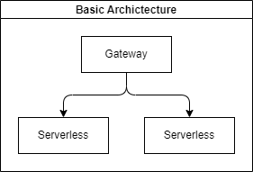

# Feathers Micro

[](https://codecov.io/gh/guzz/feathers-micro)

Create applications in a microservice architecture with [FeathersJS](https://feathersjs.com/) framework and [serverless](https://www.serverless.com/).

## Purpose

The idea of this library is to offer some basic helpers for constructing microservice architectures with feathersJS and serverless frameworks.

## Architecture



The main entry point for the api will be a normal FeathersApp that will be our gateway. In this app you will register your MicroService Services that will proxy requests to each specific serverless application.

The main idea is to create applications as a mono-repository so we can share types between them, so you can have your services in the gateway application with the correct typing.

## Websockets

Websockets are not supported by this library, as serverless functions are not are not active servers they do not offer socket connectivity. Although it is possible to create an event bridge to handle events between the applications.

## How to use it

There are 2 libraries to be used, each with it's own detailed documentation:

- [@feathers-micro/microservice](./packages/microservice/) - Register the serverless services in your gateway application.
- [@feathers-micro/serverless](./packages/serverless/) - Helps implementing your feathers serverless micro service applications.

## Example

You can check an example of implementation in the [apps](./apps/) of the repository.

To run the example:

```bash
# install the dependencies
yarn

# run the 3 applications at the same time
yarn dev
```

## Disclaimer

This repository was created for a personal project and more as an example of architecture, so if you want to used it do at your own risk.

For more cloud friendly micro service architecture with the FeatherJS framework check [feathers-distributed](https://github.com/kalisio/feathers-distributed).